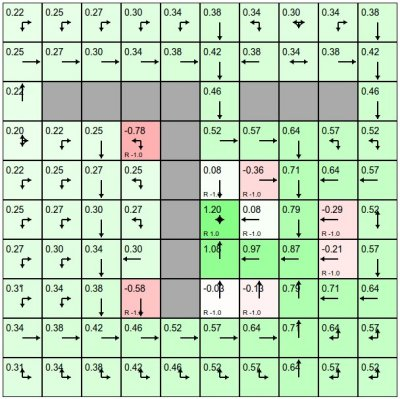

# About

**REINFORCEjs** is a Reinforcement Learning library that implements several common RL algorithms supported with fun web demos, and is currently maintained by [@karpathy](https://twitter.com/karpathy). In particular, the library currently includes:

### Dynamic Programming

For solving finite (and not too large), deterministic MDPs. The solver uses standard tabular methods will no bells and whistles, and the environment must provide the dynamics.

<div style="text-align:justify; margin: 20px; float:right; max-width:300px;">
<br>
Right: A simple Gridworld solved with a Dynamic Programming. Very exciting. Head over to the <a href="gridworld_dp.html">GridWorld: DP demo</a> to play with the GridWorld environment and policy iteration.
</div>

### Tabular Temporal Difference Learning

Both SARSA and Q-Learning are included. The agent still maintains tabular value functions but does not require an environment model and learns from experience. Support for many bells and whistles is also included such as Eligibility Traces and Planning (with priority sweeps).

### Deep Q Learning

Reimplementation of [Mnih et al.](http://www.nature.com/nature/journal/v518/n7540/full/nature14236.html) Atari Game Playing model. The approach models the action value function Q(s,a) with a neural network and hence allows continuous input spaces. However, with a fixed number of discrete actions. The implementation includes most of the bells and whistles (e.g. experience replay, TD error clamping for robustness).

### Policy Gradients

The implementation includes a stochastic policy gradient Agent that uses REINFORCE and LSTMs that learn both the actor policy and the value function baseline, and also an implementation of recent Deterministic Policy Gradients by [Silver et al](http://www0.cs.ucl.ac.uk/staff/d.silver/web/Publications_files/deterministic-policy-gradients.pdf). To make a lot of this happen (e.g. LSTMs in particular), the library includes a fork of my previous project [recurrentjs](https://github.com/karpathy/recurrentjs), which allows one to set up graphs of computations over matrices and perform automatic backprop.

I do not include the demo for policy gradient methods because the current implementations are unfortunately finicky and unstable (both stochastic and deterministic). I still include the code in the library in case someone wants to poke around. I suspect that either there are bugs (It's proving difficult to know for sure), or I'm missing some tips/tricks needed to get them to work reliably.

# Example Library Usage

Including the library (currently there is no nodejs support out of the box):

```javascript
&lt;script type="text/javascript" src="lib/rl.js"&gt;&lt;/script&gt;
```

For most applications (e.g. simple games), the DQN algorithm is a safe bet to use. If your project has a finite state space that is not too large, the DP or tabular TD methods are more appropriate. As an example, the DQN Agent satisfies a very simple API:

<pre><code class="js">
// create an environment object
var env = {};
env.getNumStates = function() { return 8; }
env.getMaxNumActions = function() { return 4; }

// create the DQN agent
var spec = { alpha: 0.01 } // see full options on DQN page
agent = new RL.DQNAgent(env, spec);

setInterval(function(){ // start the learning loop
  var action = agent.act(s); // s is an array of length 8
  //... execute action in environment and get the reward
  agent.learn(reward); // the agent improves its Q,policy,model, etc. reward is a float
}, 0);
</code></pre>

In other words, you pass the agent some vector and it gives you an action. Then you reward or punish its behavior with the `reward` signal. The agent will over time tune its parameters to maximize the rewards it obtains.

The full source code is on <a href="https://github.com/karpathy/reinforcejs">Github</a> under the MIT license.


<br><br><br><br><br><br><br>
